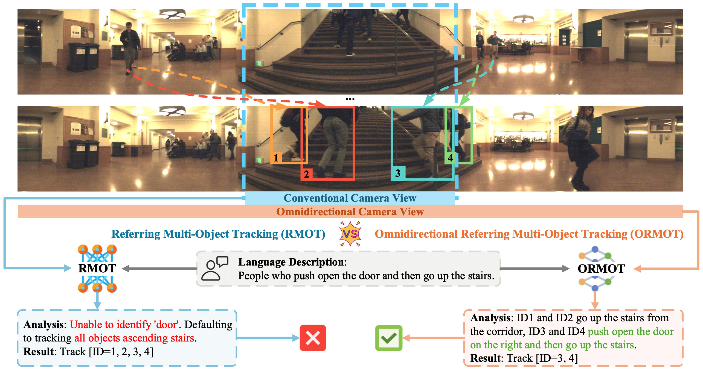

# 🚀 ORMOT: A Dataset and Framework for Omnidirectional Referring Multi-Object Tracking
                
> [**ORMOT: A Dataset and Framework for Omnidirectional Referring Multi-Object Tracking**](https://arxiv.org/pdf/2603.05384)  
> Sijia Chen *, Zihan Zhou *, Yanqiu Yu, En Yu, Wenbing Tao   
> Huazhong University of Science and Technology                       
> *[ArXiv] Paper ([https://arxiv.org/pdf/2603.05384](https://arxiv.org/pdf/2603.05384))*

**Note:** 

If our paper is accepted, we will fully open-source our **ORSet dataset** and **ORTrack framework** (including its code and model weights) **within one month**, **just like our [**CRMOT**](https://github.com/chen-si-jia/CRMOT) project**.

Thanks for your attention! If you are interested in our work, please give us a star ⭐️.

## 🔍 ORMOT vs RMOT



**Comparison between ORMOT and RMOT.** 

**Omnidirectional Referring Multi-Object Tracking (ORMOT):** The wide field of view from the omnidirectional camera not only provides spatial advantages but also extends tracking duration by offering "extended temporal context", enabling ORMOT models to correctly understand long-horizon language description and accurately track objects. 

**Referring Multi-Object Tracking (RMOT):** Conventional cameras have limited fields of view, making it more difficult for existing common RMOT models to understand long-horizon language description and perform accurate tracking.

## ✏️ Citation
```
@article{chen2026ormot,
  title={ORMOT: A Dataset and Framework for Omnidirectional Referring Multi-Object Tracking},
  author={Chen, Sijia and Zhou, Zihan and Yu, Yanqiu and Yu, En and Tao, Wenbing},
  journal={arXiv preprint arXiv:2603.05384},
  year={2026}
}
```
